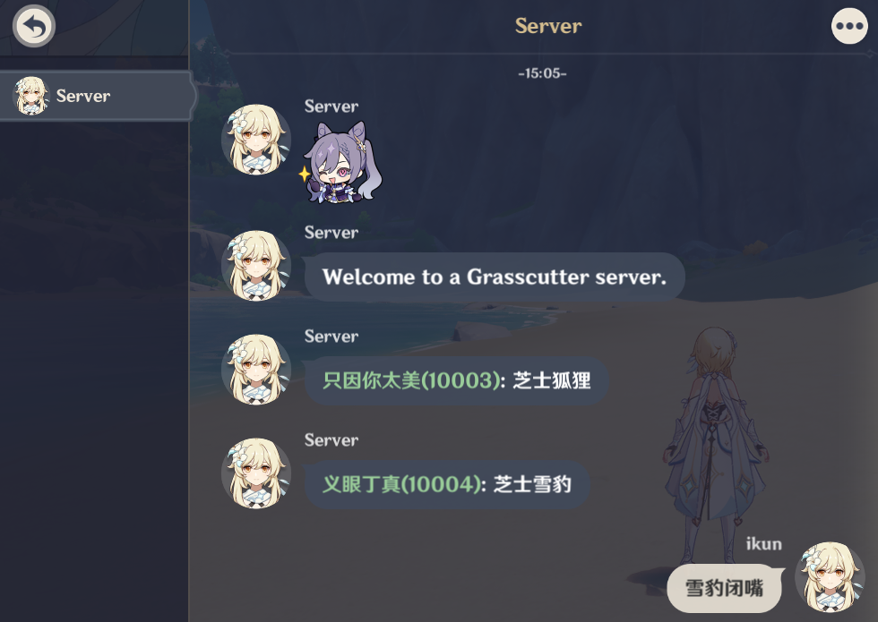

# gc-openchat-plugin

[](https://github.com/jie65535/gc-openchat-plugin/blob/main/LICENSE)
[](https://github.com/jie65535/gc-openchat-plugin/stargazers)
[](https://github.com/jie65535/gc-openchat-plugin/releases)
[](https://github.com/jie65535/gc-openchat-plugin/releases/latest)
[](https://github.com/jie65535/gc-openchat-plugin/actions/workflows/build.yml)

中文 | [English](README-en-US.md)

让玩家在服务器内聊天



在游戏内与服务器账号对话，相当于发送到世界频道，服务器内所有玩家均可收到消息。

## TODO List
- [x] 玩家间聊天
- [x] 聊天管理命令
- [x] 发言频率限制
- [ ] 聊天内容审查
- [ ] 聊天api _(~~OneBot api~~)_
- [ ] ...

## 安装

1. 在 [Release](https://github.com/jie65535/gc-openchat-plugin/releases) 下载`jar`
2. 放入 `plugins` 文件夹即可

## 命令
玩家用：
- `/chat on` 接受聊天消息（默认）
- `/chat off` 屏蔽聊天消息

管理用（需要 `server.chat.others` 权限）：
- `/serverchat on` 启用服务器聊天（默认）
- `/serverchat off` 关闭服务器聊天
- `/serverchat ban @uid [时间（分钟）]` 禁言指定玩家
- `/serverchat unban @uid` 解除指定玩家禁言
- `/serverchat limit <次每分钟>` 设置发消息频率限制
- `/serverchat reload` 重载配置文件

`/serverchat` 可用别名 `/sc`


## 配置
```json5
{
  // 服务器聊天开关
  serverChatEnabled: true,
  
  // 服务器聊天消息格式
  // {nickName}   为玩家昵称
  // {uid}        为玩家UID
  // {message}    为消息内容
  serverChatFormat: "<color=#99CC99>{nickName}({uid})</color>: {message}",
  
  // 每分钟发言消息数限制
  messageFreLimitPerMinute: 20,
  
  // 是否在玩家加入时发送消息
  sendJoinMessage: true,
  
  // 玩家加入时发送消息
  joinMessage: "本服已启用聊天，/chat on 开启（默认），/chat off 屏蔽",

  // 被禁言反馈消息
  bannedFeedback: "你已经被禁言！",

  // 消息太频繁反馈消息
  // {limit} 服务器设置的限制次数
  msgTooFrequentFeedback: "服务器设置每分钟仅允许发言{limit}次"
}
```

